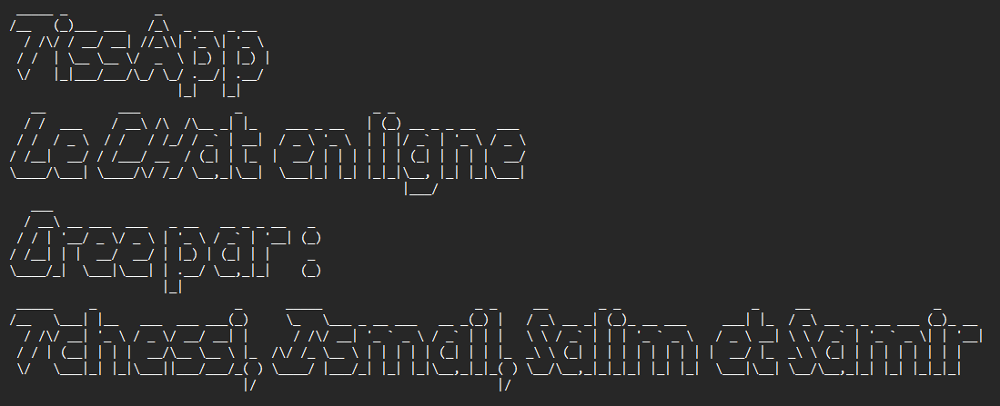

# TISSAPP - Application Mobile de Chat

<div align="center">
  
</div>

## Introduction
TISSAPP est une application de chat mobile développée avec React Native. Elle est accompagnée d'un back-end Node.js avec Sequelize comme ORM et d'un panneau d'administration construit avec Nuxt.js. L'application permet aux utilisateurs de discuter en temps réel, de créer des groupes de discussion et d'envoyer des messages.

## Prérequis
- Node.js (version 16 ou supérieure)
- npm (version 9 ou supérieure)
- Serveur de base de données MySQL (XAMPP ou WAMP)

## Installation de MySQL et phpMyAdmin
Si vous ne souhaitez pas utiliser XAMPP ou WAMP et préférez installer MySQL directement sur votre machine, suivez les étapes ci-dessous :

### Installation de MySQL
1. Téléchargez et installez MySQL à partir du site officiel : [https://dev.mysql.com/downloads/installer/](https://dev.mysql.com/downloads/installer/)
2. Exécutez le programme d'installation et suivez les instructions pour configurer MySQL.
3. Lors de la configuration, assurez-vous de définir un nom d'utilisateur et un mot de passe pour l'utilisateur "root". Notez ces informations, car elles seront nécessaires ultérieurement.

### Configuration de MySQL
1. Ouvrez une fenêtre de terminal ou de console.
2. Pour démarrer le serveur MySQL, exécutez la commande suivante :
   ```bash
   mysql.server start

### Lancement de phpMyAdmin
1. Ouvrez une nouvelle fenêtre de terminal ou de console.
2. Accédez au répertoire où vous avez installé phpMyAdmin.
3. Lancez le serveur intégré de phpMyAdmin avec la commande suivante :
   ```bash
   php -S localhost:8080 -t .
4. Ouvrez un navigateur web et accédez à http://localhost:8080.
5. Vous devriez voir l'interface de phpMyAdmin où vous pouvez vous connecter en utilisant les informations d'identification de l'utilisateur que vous avez créé précédemment.


## Installation et lancement du projet TissApp
Suivez les étapes ci-dessous pour installer et lancer le projet TISSAPP.

### PowerShell install project
1. Ouvrez PowerShell dans le répertoire du projet.
2. Exécutez la commande `./script/install.bat` pour installer les packages du projet.
### PowerShell launch project
1. Ouvrez PowerShell dans le répertoire du projet.
2. Exécutez la commande `./script/launch.bat` pour lancer les scripts du projet.

### Git Bash install project
1. Ouvrez Git Bash dans le répertoire du projet.
2. Exécutez la commande `./script/install.sh` pour installer les packages du projet.

### Git Bash launch project
1. Ouvrez Git Bash dans le répertoire du projet.
2. Exécutez la commande `./script/launch.sh` pour lancer les scripts du projet.

## Liens Utiles
- [Tableau Trello du projet](https://trello.com/invite/tchessisamirismailsalim/ATTI9472e90e9d0b4861b4b1a72e24a8ecd3FCA49511)
- [Maquette du projet sur Figma](https://www.figma.com/file/pCwlYbexxiYcB8oRVCCwf5/Untitled?node-id=0%3A1&t=QOBwCJjSdCwnd9wU-0)

Merci d'avoir choisi TISSAPP ! N'hésitez pas à nous contacter en cas de besoin.




